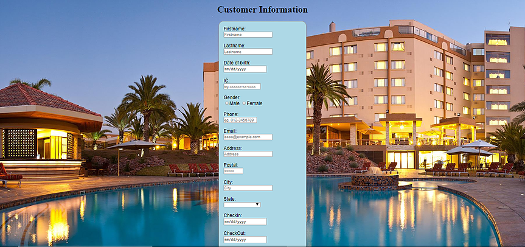
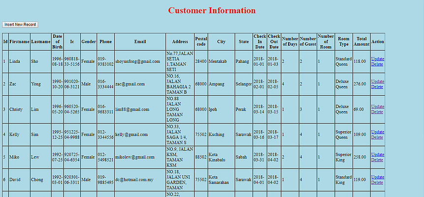
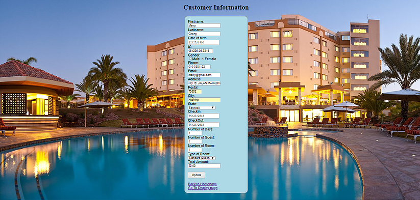

# HotelBookingSystem

 This is a web programming course individual project by creating a simple database website.

This website is using HTML, CSS, PHP and MySQL.
 

The functionality of this website:
  <ul><li>insert data</li>
  <li>delete data</li>
  <li> update data</li>
  <li>display data</li>
</ul>

<h3>Homepage of Hotel Booking System</h3>

<h3>Insert page</h3>

<h3>Display page</h3>

<h3>Update page</h3>

<footer>
  
My web programming course e-Portfolio link : https://linda-sho.wixsite.com/mysite-4 
</footer>
